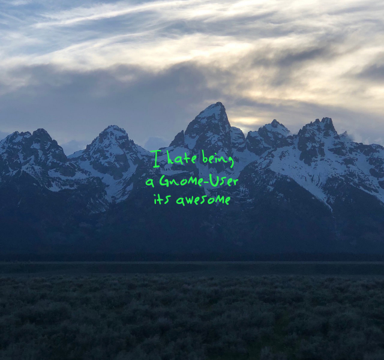
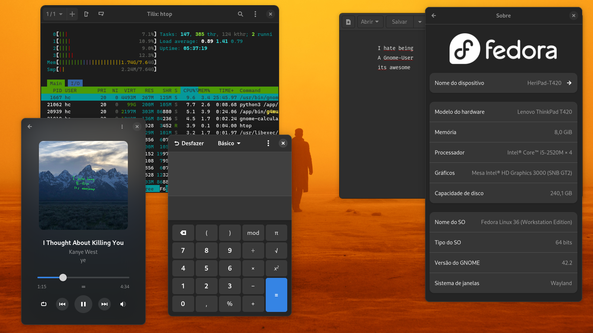
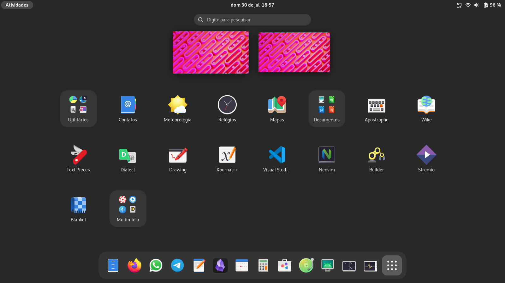

In this post i will try to explain my setup and ramble about gnome devs and this DE

# The Idea:

Just a Screen. Simple as that.

I call all my programs through shortcuts. I use the overview sometimes to switch workspaces or to see the time/date, I think it works pretty great.

## Themes

I just use the normal adwaita theme. To be honest I kinda like the old one more, with all the depth and that kinda-like skeuomorphic design. It was "modern" but not taste-less like GTK4.

To make everthing consistent i installed [Adw-GTK3](https://github.com/lassekongo83/adw-gtk3), it makes the GTK3 programs look like GTK4 ones.

## Icons

I gave up trying to customize stuff, i just use [MoreWaita](https://github.com/somepaulo/MoreWaita) now, i think it looks cute.

# Extensions

1. [Auto Activities](https://extensions.gnome.org/extension/5500/auto-activities/)

This is kinda useless, but i like it. it opens the overview when there is no programs open.

1. [Caffeine](https://extensions.gnome.org/extension/517/caffeine/)

I use this to disable the screensaver when i am doing something where i don't touch the mouse for a long time. It also disables the screensaver when i am in fullscreen.

1. [Custom Accent Colors](https://extensions.gnome.org/extension/5547/custom-accent-colors/)

I don't like much color, so i made everything gray.

1. [GSConnect](https://extensions.gnome.org/extension/1319/gsconnect/)

This is incredible, it works so well. I can have notifications, sync the clipboard, mute the computer when i get a call, control the music, send files and etc. I use it with KDEConnect on my phone.

1. [GTK3 Theme Switcher](https://extensions.gnome.org/extension/5401/gtk3-theme-switcher/)

So when the night-theme kicks in, the GTK3 programs also change to the dark theme.

1. [Just Perfection](https://extensions.gnome.org/extension/3843/just-perfection/)

This has everthing, i use to only show the top bar in the overview, make the dock slighly smaller and some other stuff.

1. [No Titlebar When Maximized](https://extensions.gnome.org/extension/4630/no-titlebar-when-maximized/)

I use shortcuts to close, minimize and maximize programs, the titlebar is useless in programs like vscode.

1. [Rounded Window Corners](https://extensions.gnome.org/extension/5237/rounded-window-corners/)

So that every window looks cute.

# Extras

## Firefox Gnome Theme

There is a theme for firefox that makes it look like Gnome Web, it's called [Firefox Gnome Theme](https://github.com/rafaelmardojai/firefox-gnome-theme), it also hides the tabs when there is only one open.

### Good Firefox Extensions

i will throw some firefox extensions so that the feds can fingerprint me.

- [Imagus](https://addons.mozilla.org/en-US/firefox/addon/imagus/)
- [Firefox Relay](https://addons.mozilla.org/en-US/firefox/addon/private-relay/)
- [Firefox Multi-Account Containers](https://addons.mozilla.org/en-US/firefox/addon/multi-account-containers/)
- [ClearURLs](https://addons.mozilla.org/en-US/firefox/addon/clearurls/)
- [skip redirect](https://addons.mozilla.org/en-US/firefox/addon/skip-redirect/)
- [uBlock Origin](https://github.com/gorhill/uBlock)
- [SponsorBlock](https://sponsor.ajay.app//)
- [DeArrow](https://dearrow.ajay.app/)

## Obsidian Adwaita Theme

I use Obsidian for most of my stuff, there is [This](https://github.com/birneee/obsidian-adwaita-theme) theme for it, i also have a public Vault where i index Kanye West Music lyrics, you can check it [here](https://github.com/herijooj/Kanye-Vault)

# Keybindings

When i started using [LARBS](https://larbs.xyz/) i got used to these keybindings, so i use them in every distro i use.

| Action | Keybinding |
| --- | --- |
| Open Terminal | `Super + Enter` |
| Open Browser | `Super + W` |
| Open File Manager | `Super + R` |
| Open Music Player | `Super + M` |
| Open Calculator | `Super + C` |
| Open Settings | `Alt + F1` |
| Lock Screen | `Super + X` |
| Screenshot | `PrtSc` |
| Logout | `Super + Esc` |
| Close Window | `Super + Q` |
| Toggle Window State | `Super + Space` |
| Left Workspace | `Super + D` |
| Right Workspace | `Super + A` |
| Move Window to Left Workspace | `Super + Shift + D` |
| Move Window to Right Workspace | `Super + Shift + A` |
| Move to Workspace [Number] | `Super + [Number]` |
| Move Window to Workspace [Number] | `Super + Shift + [Number]` |

# Final Thoughts

I am happy with my setup. I Hate gnome so much you have no idea, but I guess I got used to it? I like the overview and a bit of the design. I tried KDE for about 20 minutes and gave up. Maybe someday I will be happy with a riced i3 setup again but i don't want to configure it.

