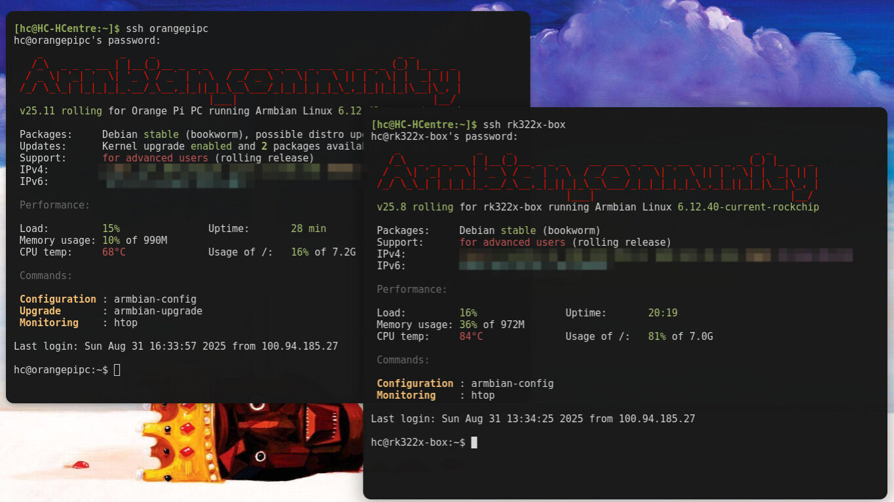

Do you know these things that are perfect? Just so happen to be perfect, not because they were designed that way, it’s more like they were born for the wrong things, but in the middle of the road they found their path, maybe kinda like me!!

That’s how I feel about this horrible piece of hardware. Let me tell a story...
Once upon a time, a Chinese manufacturer wanted to do an Android TV box. But then, without any money, they went for the cheapest, most horrible components they could find and built the damn thing.  
They did not bother with DRMs, locking the bootloader, or anything. They didn’t even bother with the horrible Android skin they had, they just wanted to make a quick buck, and a quick buck they did for a while.  
Then time passed. The chip is outdated. The Android version does not work with anything anymore. It is a relic of the past... that you can have for a measly 9.40 bucks!!! Oh my God. This fucking changes everything! For only 50 BRL you can get a (horrible) PC capable of doing anything (mostly nothing)! How can you pass on that deal?

## How to:

<https://forum.armbian.com/topic/34923-csc-armbian-for-rk322x-tv-box-boards/>
This guide worked great for one of my TV boxes (foreshadowing). I suggest you read it. You can also install loads of other things, I stuck with [Debian](https://www.debian.org/), there are also [Kodi](https://kodi.tv/) images and other software.  
The other one has an Allwinner H3. I used an [Orange Pi](http://www.orangepi.org/) image and could not make it boot from any of the USB ports, so it runs with an SD card.  

## You can just do things.

These TV boxes have a chipset from ~2016, they use little to no power. They have horrible processors, little to no RAM, not much storage space. They are fucking perfect for a bad programmer to learn to do things correctly. I wrote [HCNews](https://github.com/herijooj/HCnews) to run on a normal computer. It took like 2 minutes to run on them. Now, the rewritten version (that is still kind of shitty) takes about 5 seconds to run, thanks to my amazing ability to deal with this horrible hardware. I would not have gone this road renting a VM or buying a good computer.  

Now I run my:  

- Newspaper (more like an RSS wrapper for Telegram and WhatsApp)  

- My [Jellyfin](https://jellyfin.org/)  

- [AdGuard](https://github.com/AdguardTeam/AdGuardHome)  

- [Radicale](https://radicale.org/)  

- [That thingy for blocking ads on YouTube](https://github.com/dmunozv04/iSponsorBlockTV)  

- [Tailscale](https://tailscale.com/)  

- Some other services  

It gives me a great deal of fun. It teaches me how to be a better sysadmin, maybe a better person overall. Go ahead and buy yourself a cheap horrible TV box and put Linux on it. It sounds idiotic, but it WILL change your life.  

